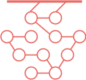

# Grapes



<a href="https://liberapay.com/amitgupta/donate"></a>


## Mainteners are needed
Though it needs just the work of few weeks. I'm quite engaged in the maintenace and development of other open source projects. I would appreciate if someone would like to raise a PR to get this thing done.

## History
I started this project by mistake... yeah you heard me right. I was developing a fast NLP tokenizer. One day I needed a feature of Regular Expression which can help me to validate some dynamic patterns. Since I was not aware that the feature is already presented with RE, I thought to code it by myself. Intially I thought to modify existing RE engine to support the new feature. But since I am bit lazy to read books, I couldn't read the whole book of Autometa theory to know how RE engine works (I dint remember how I passed the exam of Autometa theory in my college) so I decided to develop my own RE engine. And that's how this project was started. Funny but True

Later on I realized that this is 3 times faster than java RE. So I decided to using Grapes instead of RE in my project. And then I introduced new features which are not even present with current RE that we'll discuss later in this ReadMe.

Currently Grapes is 1.5-2 times faster than current Java RE.

**Contribute** : You can contribute to this project by adding new features mentioned at the end of this README or by testing and figuring out bug if any, or by just writing more unit tests to cover more scenarios that I may have missed, or just to buy some time for me by donating. [](https://www.paypal.com/cgi-bin/webscr?cmd=_s-xclick&hosted_button_id=KQJAX48SPUKNC)

## Description
Grapes is kind of Regular Expression to make string comparision faster.

Let's understand it with some examples;

1. Create the Grapes as you create RE (not all the features of RE is supported currently)

  ```java
	seq = new BooleanSequence("ab(cde|c)?mn");
  ```
2. Compile it and minimize it. Better to do it in the starting of your application.

  ```java
	seq.compile().minimize();
  ```
  
3. Use an appropriate Matcher

  ```java
	CoreMatcher matcher = seq.getCoreMatcher();
  ```
4. Assert

  ```java
    assertTrue(matcher.match("abmn".toCharArray()));
    assertTrue(matcher.match("abcdemn".toCharArray()));
    assertTrue(matcher.match("abcmn".toCharArray()));
  ```

Currently 3 types of matcher are supported.

1. **Core Matcher** (as explained above)
2. **Progressive Matcher** : You need not to pass complete string for comparison in one go. It is good in case of streams.
  
  ```java
	BooleanSequence seq = new BooleanSequence("a([bc])d(mn|o)\\1a\\2");
	seq.capture = true;
	seq.compile().minimize();
	ProgressiveMatcher matcher = new ProgressiveMatcher(seq);

	Assert.assertEquals(FAILED,matcher.match());
	Assert.assertEquals(MATCHED,matcher.match("ab".toCharArray()));
	Assert.assertEquals(MATCHED,matcher.match("abdob".toCharArray()));
	Assert.assertEquals(PASSED,matcher.match("abdobao".toCharArray()));
  ```
  
3. **Lazy Matcher** : They are same as Progressive Matcher. But with this matcher you can pass just the extra part of string.
  
  ```java
	BooleanSequence seq = new BooleanSequence("a([bc])d(mn|o)\\1a\\2");
	seq.capture = true;
	seq.compile().minimize();
	LazyMatcher matcher = new LazyMatcher(seq);

	Assert.assertEquals(FAILED,matcher.match());
	Assert.assertEquals(MATCHED,matcher.match("ab".toCharArray()));
	Assert.assertEquals(MATCHED,matcher.match("dob".toCharArray()));
	Assert.assertEquals(PASSED,matcher.match("ao".toCharArray()));
  ```
  
These are the 3 matchers I intially created. But you can create your own matchers of different features. Moreover, currently they accept char[] as input. But you can create them to accept byte[], list etc. to make them more fast. One of the sample matcher I have created under the matcher package.

## Features
In addition of this; There are many other features;

* **JSON view** : You can convert a Grapes sequence to json. I have created a temporary visualization tool to understand how a sequence is evaluated.
  
  ```java
	RESequenceUtil.toJson(reSeq));
  ```
* **Merge Sequences** : You can merge any number of sequences.
  
  ```java
	BooleanSequence rootSeq = new BooleanSequence("");rootSeq.compile().minimize();
	BooleanSequence angleSeq = new BooleanSequence("-?0(.0)?°",TokenType.ANGLE); angleSeq.compile().minimize();
	BooleanSequence cordinateSeq = new BooleanSequence("-?0(.0)?° -?0(.0)?['′] -?0(.0)?[\"″] a",TokenType.G_Cordinate);cordinateSeq.compile().minimize();
	BooleanSequence tempratureSeq = new BooleanSequence("-?0(.0)?° ?a",TokenType.TEMPRATURE);tempratureSeq.compile().minimize();

	rootSeq.merge(angleSeq).merge(cordinateSeq).merge(tempratureSeq);
	 
	ProgressiveMatcher matcher = rootSeq.getProgressiveMatcher();
	 
	Assert.assertEquals(TokenType.ANGLE,matcher.match("0°".toCharArray()));
	Assert.assertEquals(TokenType.G_Cordinate,matcher.match("0° 0′ 0″ a".toCharArray()));
  ```
  
* **Custom return type** : Instead of just returning whether your string is matching to a sequence or not, you can also return custom type. It is basically helpful when you merge multiple type of expressions. You can refer above example for the same. By default it returns : PASSED, MATCHED, FAILED.
	
* **Optimized expressions** : Whether you write "bc|bcd|bcde" , "bc(d|de)?", or "bc(de?)?", Grapes Parser parses the same sequence. Hence the performance of evaluating all mentioned 3 expressions is same.

and more ...

### Supported RE symbols
Currently Grapes is supporting following RE symbols

* Range Selector : [,] eg [a-zA-Z0-9], [abc]
* Grouping, Capture, Sub Expression using '(', ')'
* Optional '?'
* Or '|'
* Any '.'
* Dynamic selection \\1 upto 9 *forgive my laziness to support upto 9 only*


### Next plan
My immediate plans to support 
* Frequence {min,max}, {,max}, {min,} , '+', '*'
* Convert into gradle project. So that you can use generated jar directly instead of compiling the project by yourself [done]


### Future Plan
* Improving "JSON to Graph" view tool
* Laziness in case of dynamic selection
* Making it thread safe
* Supporting more RE symbols


### Worth to mention

- **[निम्न (NIMN)](https://github.com/nimndata/spec)** : Schema aware object compression. 60% more compressed than JSON. 40% more compressed than msgpack.
- **[imglab](https://github.com/NaturalIntelligence/imglab)** : Web based tool to label images for object. So that they can be used to train dlib or other object detectors. You can integrate 3rd party libraries for fast labeling.
- [fast-lorem-ipsum](https://github.com/amitguptagwl/fast-lorem-ipsum) : Generate lorem ipsum words, sentences, paragraph very quickly.
- [stubmatic](https://github.com/NaturalIntelligence/Stubmatic) : A stub server to mock behaviour of HTTP(s) / REST / SOAP services.
- [अनुमार्गक (anumargak)](https://github.com/NaturalIntelligence/anumargak) : Amazinf fast router for node web servers.
- [fastify-xml-body-parser](https://github.com/NaturalIntelligence/fastify-xml-body-parser/) : Fastify plugin / module to parse XML payload / body into JS object using fast-xml-parser.
- [Grapes](https://github.com/amitguptagwl/grapes) : Flexible Regular expression engine (for java) which can be applied on char stream. (under development)
